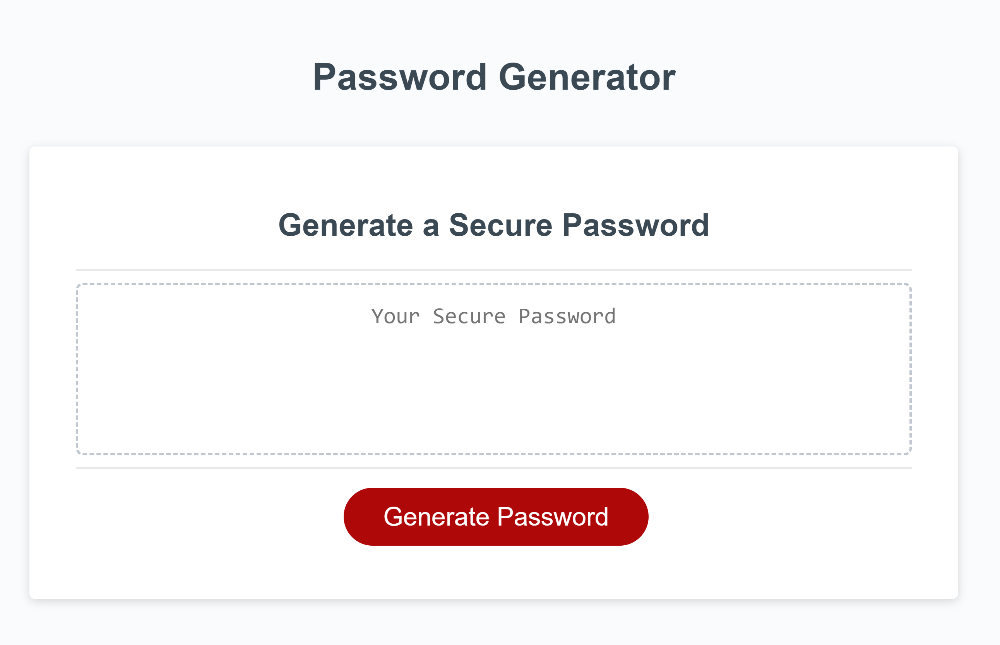

# Password-Generator
This site is created to be a password generator for Week 3 Java script challenge. 
This site is created to generate a secure password for the user with the power of Java Script. 

## Description
This site has direct forward and instructive window messages with ituitive buttons confirmation windows to help the user to quickly generate a secure password include at least one of the follwing characters between the length of 8-128 total characters:
<li>Uppercase Characters</li>
<li>Lowercase Characters</li>
<li>Numeric Characters</li>
<li>Special Characters</li>

 

A number must be entered when first prompt for password length, or else an alert message will show to remind the users 

Here you may find the links to my work: 
<li>Deployed Website: https://ronin1702.github.io/password-generator</li>
<li>Repo: https://github.com/Ronin1702/password-generator</li>
 

Here is a screenshot to the deployed website: 

